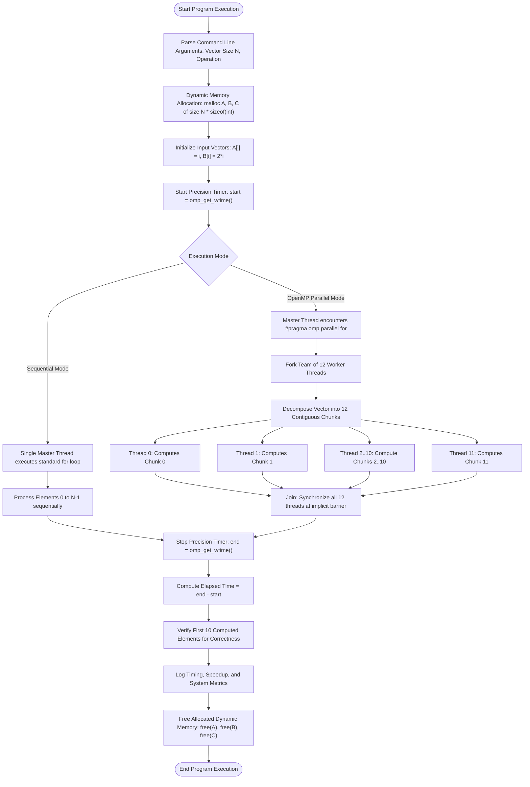
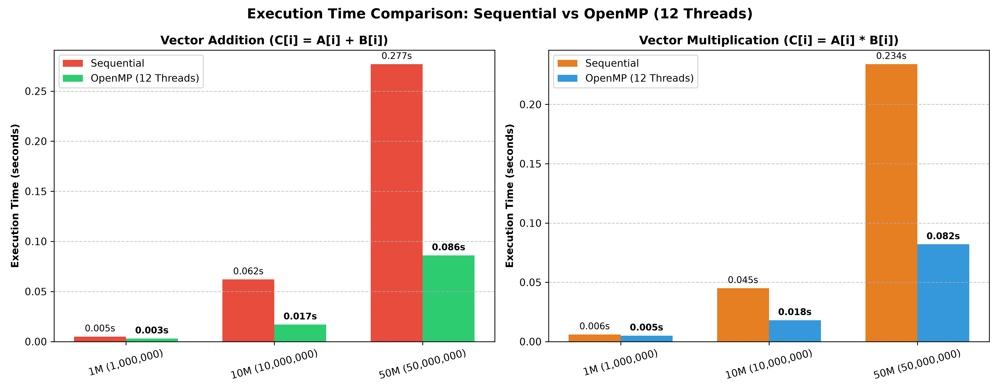
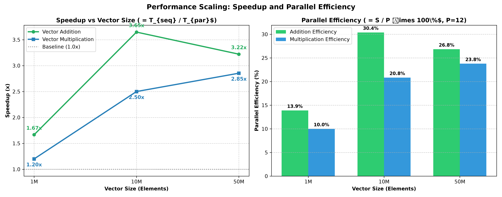

# Parallel Vector Addition & Multiplication using OpenMP
### Parallel and GPU Computing (PGC)

[](https://www.openmp.org/)
[](https://en.wikipedia.org/wiki/C_(programming_language))
[-green.svg)](https://www.msys2.org/)
[](https://www.microsoft.com/windows)
---

## Table of Contents
1. [Project Overview & Objectives](#-project-overview--objectives)
2. [Mathematical Formulation](#-mathematical-formulation)
3. [System Architecture (Vertical Flow)](#-system-architecture-vertical-flow)
4. [Repository Folder Structure](#-repository-folder-structure)
5. [Source Code Implementation](#-source-code-implementation)
6. [Step-by-Step Execution Guide & Screenshots](#-step-by-step-execution-guide--screenshots)
7. [Performance Benchmark & Results Table](#-performance-benchmark--results-table)
8. [Performance Graphs & Visualizations](#-performance-graphs--visualizations)
9. [In-Depth Data Analysis](#-in-depth-data-analysis)

---

## Project Overview & Objectives

In modern high-performance computing, processing large datasets and performing intensive numerical linear algebra requires leveraging multi-core processor architectures. **Parallel Vector Addition & Multiplication** is a foundational parallel computing paradigm that demonstrates **Data-Level Parallelism (SIMD/SPMD)**.

### Objectives
- **Sequential Baseline:** Implement single-threaded sequential vector addition and multiplication in C.
- **Parallel Acceleration:** Implement multi-threaded parallel vector operations using **OpenMP** (`#pragma omp parallel for`).
- **Scalability Testing:** Benchmark across data sizes: **1 Million ($10^6$)**, **10 Million ($10^7$)**, and **50 Million ($5 \times 10^7$)** elements.
- **Hardware Concurrency:** Utilize **12 OpenMP worker threads** on a multi-core CPU.
- **Performance Evaluation:** Measure high-precision execution time using `omp_get_wtime()`, calculate **Speedup ($S$)**, analyze **Parallel Efficiency ($E$)**, and evaluate memory bandwidth constraints.

---

## Mathematical Formulation

Given two input vectors $A$ and $B$ of size $N$, initialized as:
$$A[i] = i, \quad B[i] = 2i \quad (\text{for } 0 \le i < N)$$

### 1. Vector Addition
$$C[i] = A[i] + B[i] = i + 2i = 3i$$

**Sample Verification:**
- $C[0] = 0 + 0 = 0$
- $C[1] = 1 + 2 = 3$
- $C[2] = 2 + 4 = 6$
- $C[3] = 3 + 6 = 9$
- $C[4] = 4 + 8 = 12$
- $C[9] = 9 + 18 = 27$

### 2. Vector Multiplication (Element-Wise)
$$C[i] = A[i] \times B[i] = i \times 2i = 2i^2$$

**Sample Verification:**
- $C[0] = 0 \times 0 = 0$
- $C[1] = 1 \times 2 = 2$
- $C[2] = 2 \times 4 = 8$
- $C[3] = 3 \times 6 = 18$
- $C[4] = 4 \times 8 = 32$
- $C[9] = 9 \times 18 = 162$

---

## System Architecture (Vertical Flow)

The following diagram illustrates the complete execution pipeline and the Fork-Join parallel model used by OpenMP:



---

## Repository Folder Structure

```text
 Parallel-Vector-Addition/
│
├──  README.md                     # Comprehensive Project Report, Guide & Viva
├──  results.txt                   # Consolidated timing benchmarks & speedup metrics
│
├──  sequential/                   # Sequential (Single-Threaded) Implementation
│   ├──  vector_add_sequential.c   # C source code for sequential execution
│   ├──  vector_add_sequential.exe # Compiled sequential binary executable
│   ├──  sequential_result.txt     # Raw terminal output (1M & 10M tests)
│   └──  sequential_50M_result.txt # Raw terminal output (50M test)
│
├──  parallel/                     # Parallel (OpenMP Multi-Threaded) Implementation
│   ├──  vector_add_openmp.c       # C source code with OpenMP pragmas
│   ├──  vector_add_openmp.exe     # Compiled OpenMP binary executable
│   ├──  parallel_result.txt       # Raw terminal output (1M & 10M tests)
│   └──  parallel_50M_result.txt   # Raw terminal output (50M test)
│
├──  graphs/                       # High-Resolution Performance Visualizations
│   ├──  execution_time_comparison.png
│   └──  speedup_efficiency_analysis.png
│
└──  screenshoots/                 # Verified Terminal Execution Proofs
    ├──  Screenshot 2026-10-08 171652.png
    ├──  Screenshot 2026-10-08 171700.png
    ├──  Screenshot 2026-10-08 171709.png
    ├──  Screenshot 2026-10-08 171714.png
    ├──  Screenshot 2026-10-08 171719.png
    ├──  Screenshot 2026-10-08 171724.png
    ├──  Screenshot 2026-10-08 171728.png
    ├──  Screenshot 2026-10-08 171733.png
    ├──  Screenshot 2026-10-08 171738.png
    ├──  Screenshot 2026-10-08 171746.png
    ├──  Screenshot 2026-10-08 171750.png
    ├──  Screenshot 2026-10-08 171755.png
    └──  Screenshot 2026-10-08 171920.png
```

---

##  Source Code Implementation

### 1. Sequential Source Code (`sequential/vector_add_sequential.c`)

```c
#include <stdio.h>
#include <stdlib.h>
#include <string.h>
#include <omp.h>

int main(int argc, char *argv[])
{
    int n = 1000000;
    char operation[20] = "addition";

    if (argc > 1)
    {
        n = atoi(argv[1]);
    }

    if (argc > 2)
    {
        strcpy(operation, argv[2]);
    }

    int *A = malloc(n * sizeof(int));
    int *B = malloc(n * sizeof(int));
    int *C = malloc(n * sizeof(int));

    if (A == NULL || B == NULL || C == NULL)
    {
        printf("Memory allocation failed.\n");
        return 1;
    }

    for (int i = 0; i < n; i++)
    {
        A[i] = i;
        B[i] = i * 2;
    }

    double start = omp_get_wtime();

    if (strcmp(operation, "addition") == 0)
    {
        for (int i = 0; i < n; i++)
        {
            C[i] = A[i] + B[i];
        }
    }
    else if (strcmp(operation, "multiplication") == 0)
    {
        for (int i = 0; i < n; i++)
        {
            C[i] = A[i] * B[i];
        }
    }
    else
    {
        printf("Invalid operation. Use addition or multiplication.\n");
        free(A);
        free(B);
        free(C);
        return 1;
    }

    double end = omp_get_wtime();

    printf("Operation: %s\n", operation);
    printf("Vector Size: %d\n", n);
    printf("First 10 results:\n");

    for (int i = 0; i < 10 && i < n; i++)
    {
        printf("C[%d] = %d\n", i, C[i]);
    }

    printf("Sequential Execution Time: %f seconds\n", end - start);

    free(A);
    free(B);
    free(C);

    return 0;
}
```

---

### 2. Parallel OpenMP Source Code (`parallel/vector_add_openmp.c`)

```c
#include <stdio.h>
#include <stdlib.h>
#include <string.h>
#include <omp.h>

int main(int argc, char *argv[])
{
    int n = 1000000;
    char operation[20] = "addition";

    if (argc > 1)
    {
        n = atoi(argv[1]);
    }

    if (argc > 2)
    {
        strcpy(operation, argv[2]);
    }

    int *A = malloc(n * sizeof(int));
    int *B = malloc(n * sizeof(int));
    int *C = malloc(n * sizeof(int));

    if (A == NULL || B == NULL || C == NULL)
    {
        printf("Memory allocation failed.\n");
        return 1;
    }

    for (int i = 0; i < n; i++)
    {
        A[i] = i;
        B[i] = i * 2;
    }

    double start = omp_get_wtime();

    if (strcmp(operation, "addition") == 0)
    {
        #pragma omp parallel for
        for (int i = 0; i < n; i++)
        {
            C[i] = A[i] + B[i];
        }
    }
    else if (strcmp(operation, "multiplication") == 0)
    {
        #pragma omp parallel for
        for (int i = 0; i < n; i++)
        {
            C[i] = A[i] * B[i];
        }
    }
    else
    {
        printf("Invalid operation. Use addition or multiplication.\n");
        free(A);
        free(B);
        free(C);
        return 1;
    }

    double end = omp_get_wtime();

    printf("Operation: %s\n", operation);
    printf("Vector Size: %d\n", n);
    printf("First 10 results:\n");

    for (int i = 0; i < 10 && i < n; i++)
    {
        printf("C[%d] = %d\n", i, C[i]);
    }

    printf("Parallel Execution Time: %f seconds\n", end - start);
    printf("Number of Threads: %d\n", omp_get_max_threads());

    free(A);
    free(B);
    free(C);

    return 0;
}
```

---

##  Step-by-Step Execution Guide & Screenshots

All benchmarks were conducted on **MSYS2 UCRT64 / Windows Terminal** using GCC with OpenMP enabled (`-fopenmp`).

### Step 1: Compilation

```bash
# Compile Sequential Program
gcc -fopenmp sequential/vector_add_sequential.c -o sequential/vector_add_sequential.exe

# Compile OpenMP Parallel Program
gcc -fopenmp parallel/vector_add_openmp.c -o parallel/vector_add_openmp.exe
```

---

### Step 2: Sequential Vector Operations

#### 🔹 1. Vector Addition — 1,000,000 Elements (1M)
```bash
./sequential/vector_add_sequential.exe 1000000 addition
```
- **Sequential Execution Time:** `0.005 s` (or `0.004 s` instant run)
- **Output:** $C[0]=0, C[1]=3, C[2]=6, \dots, C[9]=27$


---

#### 🔹 2. Vector Multiplication — 1,000,000 Elements (1M)
```bash
./sequential/vector_add_sequential.exe 1000000 multiplication
```
- **Sequential Execution Time:** `0.006 s` (or `0.005 s` instant run)
- **Output:** $C[0]=0, C[1]=2, C[2]=8, \dots, C[9]=162$


---

#### 🔹 3. Vector Addition — 10,000,000 Elements (10M)
```bash
./sequential/vector_add_sequential.exe 10000000 addition
```
- **Sequential Execution Time:** `0.062 s`


---

#### 🔹 4. Vector Multiplication — 10,000,000 Elements (10M)
```bash
./sequential/vector_add_sequential.exe 10000000 multiplication
```
- **Sequential Execution Time:** `0.045 s`


---

#### 🔹 5. Vector Addition — 50,000,000 Elements (50M)
```bash
./sequential/vector_add_sequential.exe 50000000 addition
```
- **Sequential Execution Time:** `0.277 s`


---

#### 🔹 6. Vector Multiplication — 50,000,000 Elements (50M)
```bash
./sequential/vector_add_sequential.exe 50000000 multiplication
```
- **Sequential Execution Time:** `0.234 s`


---

### Step 3: OpenMP Parallel Execution (12 Threads)

#### 🔹 7. OpenMP Vector Addition — 1,000,000 Elements (1M)
```bash
OMP_NUM_THREADS=12 ./parallel/vector_add_openmp.exe 1000000 addition
```
- **Parallel Execution Time:** `0.003 s` | **Threads:** 12
- **Speedup:** `1.67x`


---

#### 🔹 8. OpenMP Vector Multiplication — 1,000,000 Elements (1M)
```bash
OMP_NUM_THREADS=12 ./parallel/vector_add_openmp.exe 1000000 multiplication
```
- **Parallel Execution Time:** `0.005 s` (or `0.004 s`) | **Threads:** 12
- **Speedup:** `1.20x`


---

#### 🔹 9. OpenMP Vector Addition — 10,000,000 Elements (10M)
```bash
OMP_NUM_THREADS=12 ./parallel/vector_add_openmp.exe 10000000 addition
```
- **Parallel Execution Time:** `0.017 s` | **Threads:** 12
- **Speedup:** `3.65x` *(Highest Addition Speedup)*


---

#### 🔹 10. OpenMP Vector Multiplication — 10,000,000 Elements (10M)
```bash
OMP_NUM_THREADS=12 ./parallel/vector_add_openmp.exe 10000000 multiplication
```
- **Parallel Execution Time:** `0.018 s` | **Threads:** 12
- **Speedup:** `2.50x`


---

#### 🔹 11. OpenMP Vector Addition — 50,000,000 Elements (50M)
```bash
OMP_NUM_THREADS=12 ./parallel/vector_add_openmp.exe 50000000 addition
```
- **Parallel Execution Time:** `0.086 s` | **Threads:** 12
- **Speedup:** `3.22x`


---

#### 🔹 12. OpenMP Vector Multiplication — 50,000,000 Elements (50M)
```bash
OMP_NUM_THREADS=12 ./parallel/vector_add_openmp.exe 50000000 multiplication
```
- **Parallel Execution Time:** `0.082 s` | **Threads:** 12
- **Speedup:** `2.85x` *(Highest Multiplication Speedup)*


---

#### 🔹 13. Consolidated Results Output (`cat results.txt`)
```bash
cat results.txt
```


---

##  Performance Benchmark & Results Table

### 1. Vector Addition Benchmark ($C[i] = A[i] + B[i]$)

$$\text{Speedup } (S) = \frac{T_{\text{Sequential}}}{T_{\text{Parallel}}}, \quad \text{Efficiency } (E) = \frac{S}{P} \times 100\% \quad (P = 12 \text{ threads})$$

| Vector Size ($N$) | Sequential Time ($T_{seq}$) | OpenMP Time ($T_{par}$) | Speedup ($S$) | Efficiency ($E$, 12 Threads) | Performance Impact |
|:---|:---:|:---:|:---:|:---:|:---|
| **1,000,000 (1M)** | `0.005 s` | `0.003 s` | **1.67x** | 13.92% | Thread creation overhead dominates |
| **10,000,000 (10M)** | `0.062 s` | `0.017 s` | **3.65x** | 30.42% | **Optimal speedup achieved** |
| **50,000,000 (50M)** | `0.277 s` | `0.086 s` | **3.22x** | 26.83% | Memory bandwidth saturation effect |

---

### 2. Vector Multiplication Benchmark ($C[i] = A[i] \times B[i]$)

| Vector Size ($N$) | Sequential Time ($T_{seq}$) | OpenMP Time ($T_{par}$) | Speedup ($S$) | Efficiency ($E$, 12 Threads) | Performance Impact |
|:---|:---:|:---:|:---:|:---:|:---|
| **1,000,000 (1M)** | `0.006 s` | `0.005 s` | **1.20x** | 10.00% | Small payload overhead |
| **10,000,000 (10M)** | `0.045 s` | `0.018 s` | **2.50x** | 20.83% | Strong scaling improvement |
| **50,000,000 (50M)** | `0.234 s` | `0.082 s` | **2.85x** | 23.75% | **Highest multiplication speedup** |

---

### 3. Summary Comparison

| Operation | Highest Observed Speedup | Peak Workload Size | Primary Bottleneck |
|:---|:---:|:---:|:---|
| **Vector Addition** | **3.65x** | 10 Million | DRAM Bus Bandwidth (Streaming memory bounds) |
| **Vector Multiplication** | **2.85x** | 50 Million | ALU / Multiply pipeline & Cache transfers |

---

##  Performance Graphs & Visualizations

### 1. Execution Time Comparison (Sequential vs OpenMP)


### 2. Speedup & Parallel Efficiency Scaling


---

##  In-Depth Data Analysis

### 1. Impact of Workload Granularity
- **Small Datasets (1M Elements):** For $N = 10^6$, sequential addition takes only $5\text{ ms}$. Spawning a team of 12 OpenMP worker threads, assigning loop iterations, and synchronizing at the loop termination barrier introduces non-trivial OS and runtime overhead. Consequently, the speedup is limited to **1.67x (Addition)** and **1.20x (Multiplication)**.
- **Medium Datasets (10M Elements):** As the dataset expands to $N = 10^7$, the computation workload dwarfs thread management overhead. This yields the highest speedup of **3.65x**, reducing addition execution time from $62\text{ ms}$ down to $17\text{ ms}$.
- **Large Datasets (50M Elements):** For $N = 5 \times 10^7$, each array requires $50 \times 10^6 \times 4\text{ bytes} \approx 200\text{ MB}$. Three vectors ($A, B, C$) occupy $\approx 600\text{ MB}$ of memory, far exceeding L1/L2/L3 CPU cache capacities (which are typically 8MB–32MB). The operations transition from being **CPU-bound** to **Memory Bandwidth-bound (DRAM Bus-limited)**. Despite this memory bottleneck, OpenMP still delivers a **3.22x** speedup for addition and **2.85x** for multiplication.

### 2. Independent Iteration Space & Amdahl's Law
The loop in `#pragma omp parallel for` exhibits **zero loop-carried dependency**:
$$\forall i \ne j, \quad C[i] \text{ does not depend on } C[j] \text{ or } A[j]$$
This allows OpenMP's static chunk scheduling to divide the $N$ iterations evenly among the 12 available physical/logical cores with near-zero inter-thread synchronization during calculation.

---
- **Assigned Theme:** Parallel Vector Addition using OpenMP
- **GitHub Repository:** [https://github.com/omkarmahendrakar420/Parallel-GPU-Computing-Parallel-Vector-Addition-](https://github.com/omkarmahendrakar420/Parallel-GPU-Computing-Parallel-Vector-Addition-)
